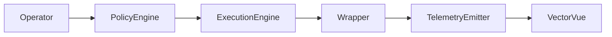
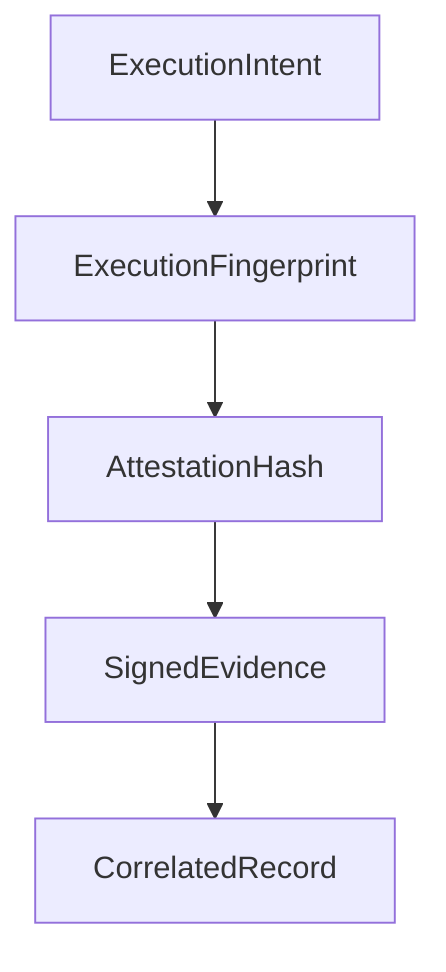
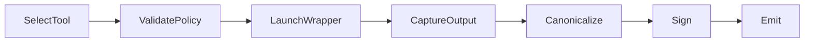
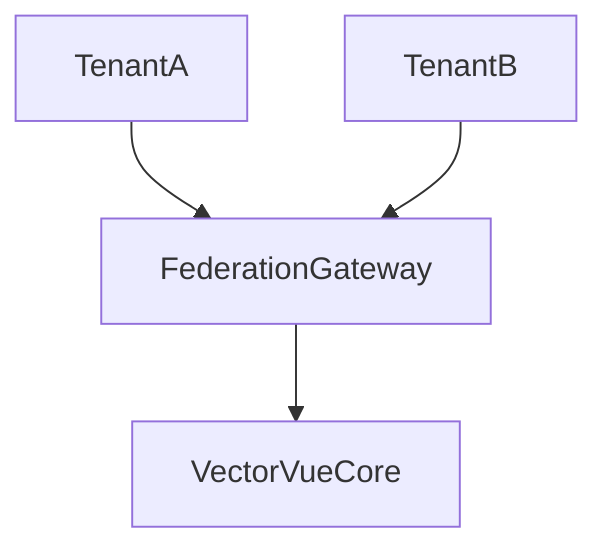
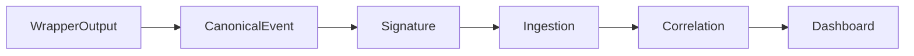

# Diagrams

## System Architecture

```mermaid
flowchart LR
Operator --> PolicyEngine
PolicyEngine --> ExecutionEngine
ExecutionEngine --> Wrapper
Wrapper --> TelemetryEmitter
TelemetryEmitter --> VectorVue
```

## Data Model

```mermaid
flowchart TD
ExecutionIntent --> ExecutionFingerprint
ExecutionFingerprint --> AttestationHash
AttestationHash --> SignedEvidence
SignedEvidence --> CorrelatedRecord
```

## Wrapper Lifecycle

```mermaid
flowchart LR
SelectTool --> ValidatePolicy --> LaunchWrapper --> CaptureOutput --> Canonicalize --> Sign --> Emit
```

## Federation Model

```mermaid
flowchart TD
TenantA --> FederationGateway
TenantB --> FederationGateway
FederationGateway --> VectorVueCore
```

## Evidence Lifecycle

```mermaid
flowchart LR
WrapperOutput --> CanonicalEvent --> Signature --> Ingestion --> Correlation --> Dashboard
```
