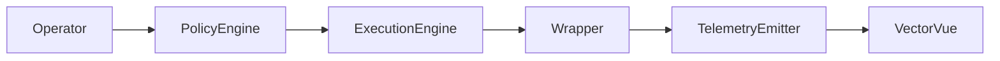

# SpectraStrike Documentation

## SpectraStrike — Operational Fabric for Attested Offensive Validation

SpectraStrike orchestrates deterministic offensive validation workflows with cryptographic attestation, policy-first execution controls, and telemetry artifacts ready for enterprise assurance pipelines.

## Problem Statement

Traditional offensive simulation workflows produce execution logs without strong provenance, repeatability guarantees, or evidence chains that survive audit and governance scrutiny. SpectraStrike closes that gap by enforcing policy, wrapper integrity, and signed execution telemetry.

## Architecture Overview

## Core Sections

- [Getting Started]({{ '/getting-started/' | relative_url }})
- [Architecture]({{ '/architecture/' | relative_url }})
- [Execution Engine]({{ '/execution-engine/' | relative_url }})
- [Wrapper Framework]({{ '/wrapper-framework/' | relative_url }})
- [Attestation & Signing]({{ '/attestation-signing/' | relative_url }})
- [Telemetry Model]({{ '/telemetry-model/' | relative_url }})
- [Policy Enforcement]({{ '/policy-enforcement/' | relative_url }})
- [CLI Reference]({{ '/cli-reference/' | relative_url }})
- [API Reference]({{ '/api-reference/' | relative_url }})
- [Enterprise Deployment]({{ '/enterprise-deployment/' | relative_url }})
- [Diagrams]({{ '/diagrams/' | relative_url }})

## Cross Product Links

- [VectorVue Docs](https://docs.vectorvue.nyxera.cloud)
- [Nyxera Nexus Docs](https://docs.nexus.nyxera.cloud)
- [Nyxera Cloud](https://nyxera.cloud)
